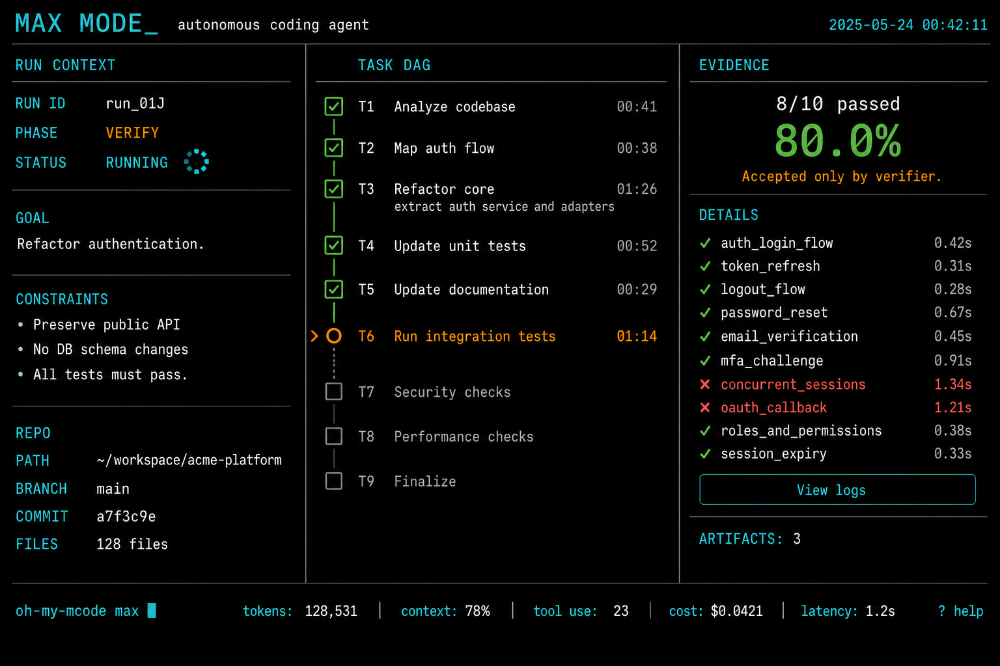

[](https://github.com/haoruilee/oh-my-mcode#oh-my-minimax-code)

[](https://github.com/haoruilee/oh-my-mcode#oh-my-minimax-code)

> *不是更多 agent。一条 `max`，一份能贴进 PR 的证据。*

[](https://github.com/haoruilee/oh-my-mcode/releases)
[](LICENSE)
[](https://github.com/haoruilee/oh-my-mcode/stargazers)
[](https://github.com/haoruilee/oh-my-mcode/issues)
[](package.json)
[](https://www.npmjs.com/package/@minimax-ai/code)

[English](README.md) | [简体中文](README.zh-CN.md)

# Oh My MiniMax Code

你在 Plan Mode、Goal 和一堆 skill 包之间来回切。提示词堆上去。祈祷测试变绿。

我们把活干完了。可落盘的 run。不能给自己打分的 verifier。

安装。敲 `max`。完事。

```bash
oh-my-mcode max "fix the failing auth tests and prove they pass"
```

## Installation

需要 Node 22+ 和 MiniMax Code CLI **`mcode` 0.1.6**（`@minimax-ai/code`）。

### TL;DR

| 你想要 | 跑这个 | 落地什么 |
| :--- | :--- | :--- |
| **插件 + CLI** | `npx oh-my-mcode install` | 复制到 `~/.minimax/plugins/oh-my-mcode` |
| **健康检查** | `npx oh-my-mcode doctor` | 包装 + 宿主检查。不联网。 |
| **宿主冒烟** | `oh-my-mcode doctor --smoke` | 一次极小的 `mcode exec`（`pong`）+ 延迟 |
| **宿主 TPS** | `oh-my-mcode doctor --tps` | 真的 `mcode exec` stream-json 用量（含 `input_tokens`）。缺宿主或假宿主打印 `unmeasured` 并无零退出，除非 `--allow-stub` |
| **从 git（尚未发 npm）** | `npx github:haoruilee/oh-my-mcode install --yes` | 同一套落盘，不依赖 registry |

```bash
npx oh-my-mcode install --yes
npx oh-my-mcode doctor
```

尚未发布到 npm 时的过渡一行：

```bash
npx github:haoruilee/oh-my-mcode install --yes
```

进阶（clone + link）：

```bash
git clone https://github.com/haoruilee/oh-my-mcode
cd oh-my-mcode
npm install
npm link
oh-my-mcode doctor
oh-my-mcode install
```

在 0.1.6 上这样放置会自动安装并启用。用 `mcode --version` 和 `mcode plugin list -m local` 确认。

**不要**从 [MiniMax-AI/skills](https://github.com/MiniMax-AI/skills) 安装本插件。那个仓库是 Claude / Cursor / Codex 的 skill 包，不是 MiniMax Code 插件。

## Highlights

| | 能力 | 干什么 |
| :---: | :--- | :--- |
| ⚡ | **`max`** | 一条命令。规划 → 实现 → 验收 → 发布。没有证据文件就不 Accept。 |
| ✅ | **`verify`** | 独立验收。先跑确定性测试。作者不能给自己的活打分。 |
| 🔗 | **Session** | 一个 run 绑一个宿主 `mcode` session。接着聊。`--no-session` 是逃生口。 |
| 🔌 | **MCP** | 同一套 harness 上的 stdio 工具：创建 / 查看 / 列出 / status / verify / interview / inspect。 |
| 👥 | **`team`** | TypeScript 扁平调度独立 builder。显式开启。默认仍是顺序 `max`。 |
| 🖥️ | **HUD** | `attach` / `status` 读同一份 `.minimax/runs/<id>/`。没有假装的 App 面板。宿主 stream 有用量就显示。 |
| 🩺 | **`doctor`** | 宿主 + 包装诚实检查。`--smoke` 是一次真的 pong exec。`--tps` 测宿主 tok/s，假宿主只打印 `unmeasured`，不编数字。 |
| 🧪 | **Evals** | 夹具测试台（pass / fail-then-repair / plan-only）。不是生产 ΔY 统计。 |

## Power commands

你只需要记住 `max`。别名：`omm`。其余是趁手工具。

```bash
oh-my-mcode interview "migrate mysql to postgres"
oh-my-mcode max --interview "fix auth and prove tests pass"
oh-my-mcode plan "migrate mysql to postgres"
oh-my-mcode verify
oh-my-mcode resume
oh-my-mcode review          # 只读；不能 Accept
oh-my-mcode ship            # 仅 Accepted
oh-my-mcode team "split independent builder tasks"
oh-my-mcode attach --watch
oh-my-mcode inspect skills
oh-my-mcode doctor --smoke
oh-my-mcode doctor --tps
```

TUI 里说 `max mode: …` 或 `interview this goal`。Skill 靠措辞触发。

`interview` 只问四句（目标、约束、验收、不做范围），停在 PLAN_REVIEW。非 TTY：`--answers answers.json` 或可重复的 `--constraint`。不跑 builder。

`max` / `plan` / `team` 支持 `--session <id>` 和 `--no-session`。`ship` **不会** `git push`，除非你传了 `--commit`。

## Host honesty

`max` 不是已注册的宿主命令 `/max`。我们与宿主 `/plan` `/goal` `/resume` `/team` 共存。我们不替换 Plan Mode。官方目录是另一套注册表——本仓库不声称已上架。

## Uninstall

```bash
npm unlink -g oh-my-mcode
rm -rf ~/.minimax/plugins/oh-my-mcode
```

## Author's note

作者：[haoruilee](https://github.com/haoruilee)。许可证：MIT。不是 MiniMax-AI 官方产品。

我想要一条信得过的交付闭环：崩溃了还能继续的 run，不能给自己作业打分的 verifier，一份能贴进 PR 的目录。

就是这个产品。欢迎 PR。

[宿主现状](docs/host-reality.zh-CN.md) · [架构](docs/architecture.zh-CN.md) · [Harness](docs/harness.md) · [路线图](docs/roadmap.md) · [AGENTS.md](AGENTS.md) · [Max Mode 模板](examples/AGENTS.max-mode.md)
